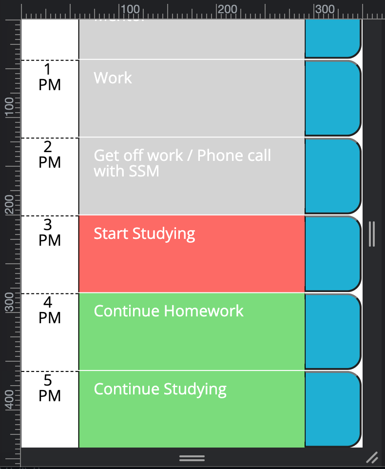
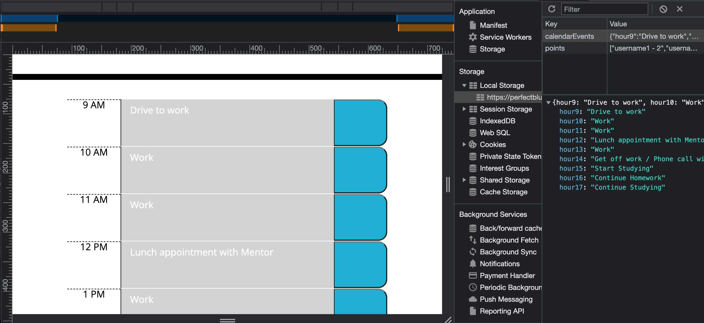

# c-5-workday-hour-scheduler-w-localStorage

## Description
In this application I wanted to practice using JQuery, Day.js, Bootstrap, working with localStorage, and JavaScript. My objective was to use these technologies to build an easy to use work-day application where users could save duties they need to perform for each hour of the work-day (9 AM - 5 PM). I learned how to use Day.js and JQuery to dynamically update my HTML and CSS code.

## Usage
To use the application click on the “Link to Deployed Page” below.

### Link to Deployed Page
https://perfectblue0.github.io/c-5-workday-hour-scheduler-w-localStorage/

### Link to Repo
https://github.com/perfectblue0/c-5-workday-hour-scheduler-w-localStorage

 Users will then see the title of the application and below it users will be able to see rows with “9 AM” to the left, a grey/salmon/green color section, and a blue button to the right of the rows. If the current time is 12 PM, “9 AM” - “11 AM” will be grey because it represents the past. The “12 PM” will be salmon colored because it represents the present time. Row “1 PM” - “5 PM” will be green because it represents the future. The blocks that are grey, red, and green are text blocks that can be written in. Once the user types out their schedule they may press the blue button to the right of the block to save that duty for that time. Clicking on the blue button will not save all of the blocks’ text; users must click each one of the texts’ blue button to save the data stored in the text block. Users can refresh the page and the data that was saved will persist on the page. Users may highlight the text and write in something else and save the new data and it will replace what was once written in the text block.

   

  

## Credits

The starter code was provided by UC Berkeley’s Full-Stack Coding Bootcamp. I created the application with a lot of help from the office hours Zoom recordings with Samantha Randolph. In addition to the recordings, I used W3Schools and Stack Overflow to complete the project.

## License

Please refer to the license in the repo.